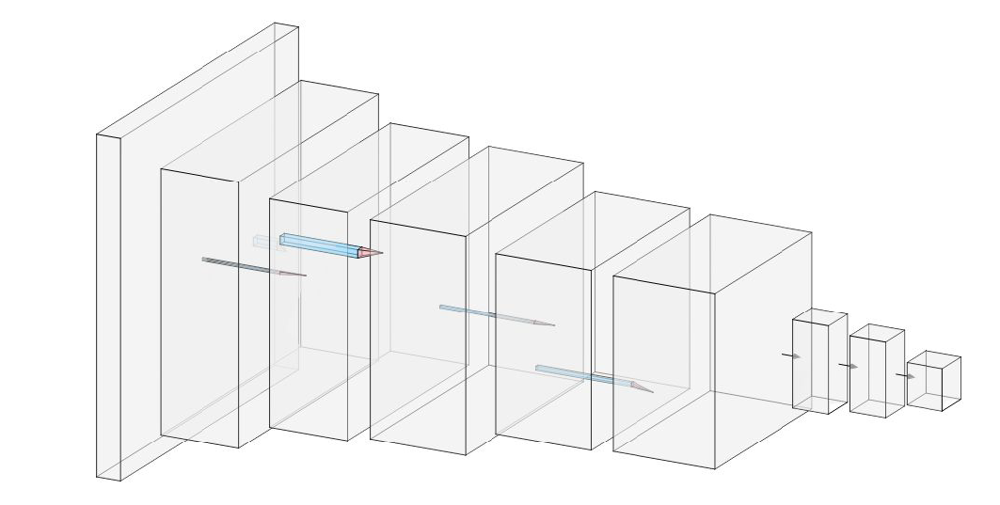
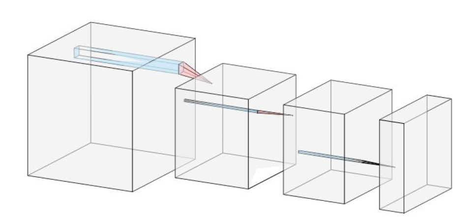
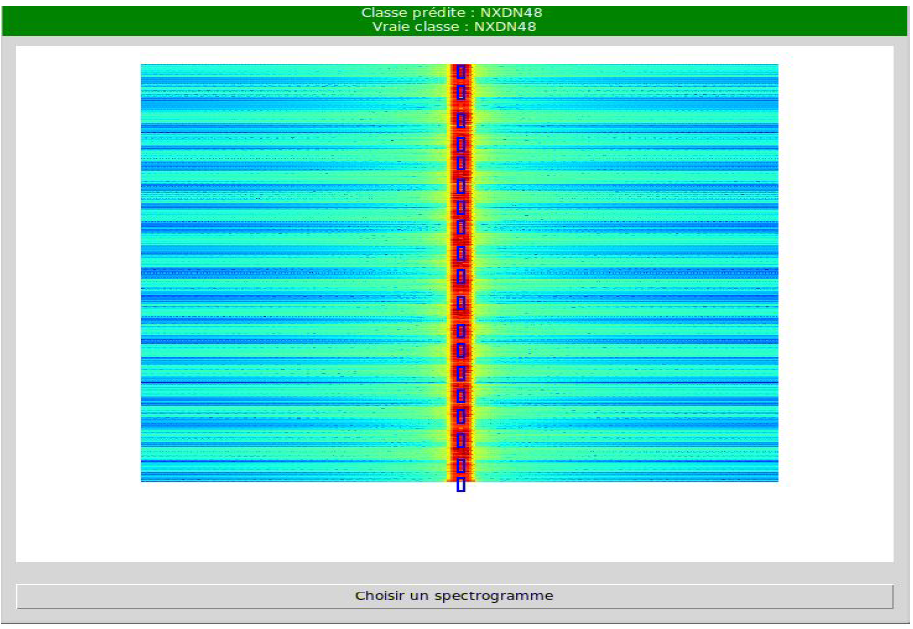

# Signal detection project
Tasks : developping a system capable of classification, localization and detection of
radiocommunication signals on spectrograms. <a href='https://sergioskar.github.io/Localization_and_Object_Detection/'>Here</a> is a good explanation of the difference between all these tasks.

## Method
OverFeat <a href="https://arxiv.org/pdf/1312.6229.pdf">paper</a>

## Classification network

The classification network consists of two parts: a first called <b>feature extractor</b> and a second one that classifies.

 
</img>

 

 <ul><li>the feature extractor is composed of a series of 3 convolution layers (the first two are followed by a max pooling layer)
<li>the last part of the classifier consist of fully connected layers that generate a vector of 12 components (the number of classes).
</ul> 

The output of all layers(except the last one) is normalized using the batch normalization technique (in order to
increase the stability of the neural network during training)

In addition, layers 4 and 5 (fully
connected) have a dropout of 40 percent. This eliminates weights
randomly during training, which reduces the number of parameters to
to train network and avoid the phenomenon of overfitting.

## Regression network

The regression network is the one in charge of locating and detecting signals.
In fact, is is composed of several regressor networks (one for each
class), each locate their signals in the image: they are called <b>class-specific</b> regressors in the paper

</img>

Each regressor has 4 outputs, which correspond to to the coordinates of the predicted bounding box. As this network takes the
feature extraction part from the input classifier network (the three
first layers), we must first train it before starting with the regressor.

The input is the feature map of the third layer of the classifier (equal in size to the image but on 384 channels)
and the output is a map of size 106x141 (the input size divided by 5), where each component is a vector of size 4, corresponding to the 4 coordinates of the bounding boxes.

Each part of the image has, therefore, an associated box. We note that the layers
are locally connected layers and not dense. In addition, the activations of all layers are linear, this is due to the fact that
the network is a regressor and not a classifier.

## HMI

The human-machine interface allows to select a spectrogram in the file system and can display the detected and localized signals with
bounding boxes and indicating the class of the selected spectrogram

</img>

